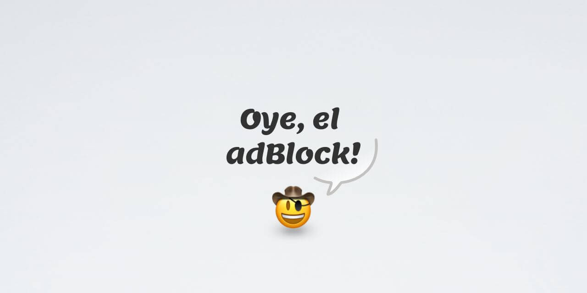

# Oye, el Adblock
@20 de septiembre de 2023 - v1.0.0

**Qué tal un plugin que te avise si NO tienes instalado un adBlock?**

Hace unos días vi que [Stefan Bohacek](https://stefanbohacek.com/) tiene en su web una alerta que aparece si entras sin un bloqueador de publicidad y me pareció una vuelta interesante: **avisar de que así no se puede ir por la vida y concienciar de las ventajas que tiene más allá de la obvia de que no nos coma la publicidad**.

Stefan ha hecho [un plugin de wordpress](https://github.com/stefanbohacek/detect-missing-adblocker), y yo quería hacer algo parecido, pero sin wp, claro :) **Un plugin de JS al que le puedo pasar una configuración mínima para personalizarlo**.

## Ad-blockers soportados

## 🤔 Y si no funciona con mi ad-blocker?

Bueno, puedes [abrir una issue](https://github.com/spacenomads/oye-el-adblock/issues/new/choose) y lo miro, aunque no prometo nada. Vamos, o me escribes al [mail](mailto:carlos@spacenomads.com) o por [mastodon](https://mastodon.social/oneeyedman).

## Demo

Puedes ver una [demo](https://spacenomads.github.io/oye-el-adblock/demo/index.html) entrando con y sin tu ad blocker.

## Y esto cómo me lo instalo?

Está todo explicado en la [documentación](./documentacion.md) ;)

## Créditos

- Gracias a [David Alonso](https://masto.es/@dalonso) por localizar el [post de Tara donde se explica lo del plugin](https://tech.lgbt/@tarajdactyl/110970682131028286).
- Thanks also to [Stefan Bohacek](https://stefanbohacek.online/@stefan), because cool isn't born. It's made. Well, maybe you can be born cool, too WDIK?
- Muchas gracias a [Infogon](https://mastodon.social/@infogon), que se ha tragado los directos, en directo.
- Y a [Bonaparty](https://paquita.masto.host/@bonapartethecat), que es un cansiniqui, pero siempre está haciendo compañía.
